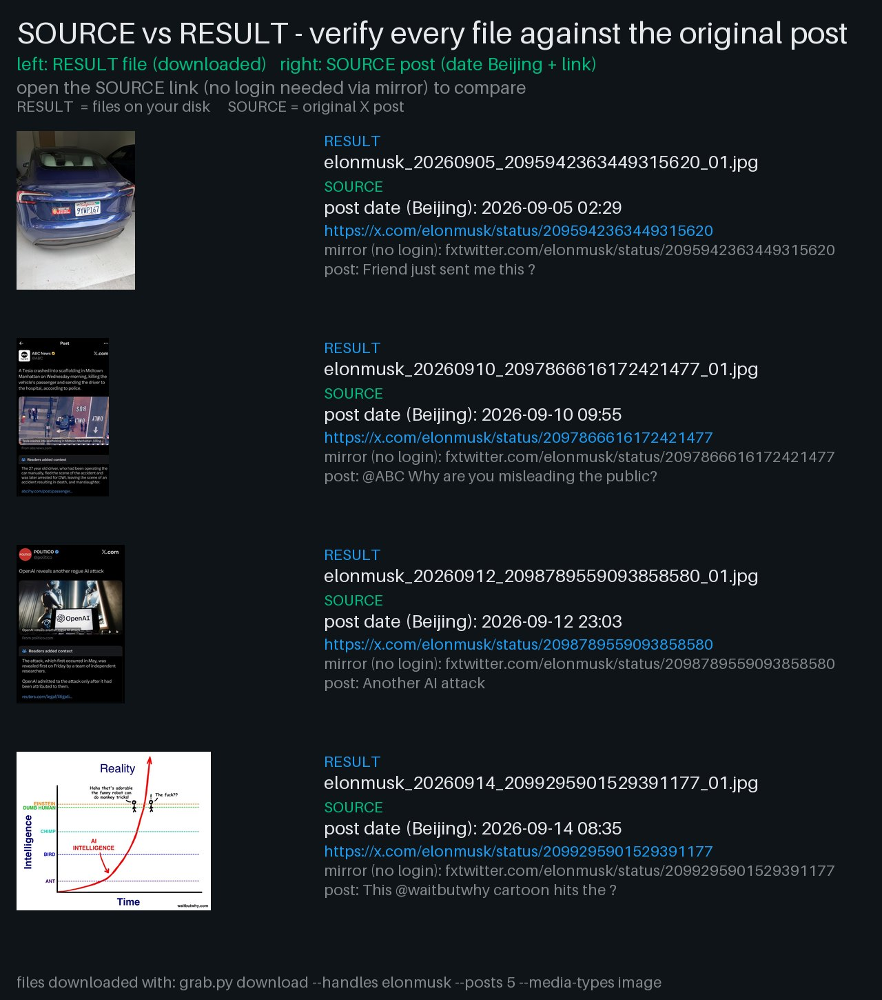

<p align="center">
  
</p>

<h1 align="center">x-media-downloader</h1>

<p align="center">
  <a href="LICENSE"></a>
  
  
</p>

<p align="center"><b>Batch-download public X / Twitter images & videos — no login, no API keys.</b><br>
单账号 / 多账号 / 榜单 TopN / 全量归档，一条命令批量抓取原图原视频。</p>

Looking for a **Twitter video downloader**, **Twitter image downloader without login**,
or a scriptable **X media downloader**? This tool fetches the newest media posts
(photos + videos, original quality) from any public X account and saves them with
fully customizable folder / filename templates.

## Demo: real run on @elonmusk (no login)

```bash
python grab.py download --handles elonmusk --posts 5 --media-types image
# [1/1] @elonmusk: posts=5 ok=4 skip=0 fail=0
```

### 1. 账号 SOURCE account — [@elonmusk](https://x.com/elonmusk)（浏览器打开需登录）

档案卡为实时公开数据：

<p align="center">
  
</p>

### 2. 帖子内容 RESULT posts — 下载到硬盘的文件，命名含帖子日期（北京时间）

点每行的来源链接即可对照原文（镜像链免登录可看）：

| 结果文件 RESULT | 帖子日期北京 SOURCE date | 来源帖子 SOURCE post |
|---|---|---|
| `elonmusk_20260905_2095942363449315620_01.jpg` | 2026-09-05 02:29 | [x.com](https://x.com/elonmusk/status/2095942363449315620) · [mirror](https://fxtwitter.com/elonmusk/status/2095942363449315620) |
| `elonmusk_20260910_2097866616172421477_01.jpg` | 2026-09-10 09:55 | [x.com](https://x.com/elonmusk/status/2097866616172421477) · [mirror](https://fxtwitter.com/elonmusk/status/2097866616172421477) |
| `elonmusk_20260912_2098789559093858580_01.jpg` | 2026-09-12 23:03 | [x.com](https://x.com/elonmusk/status/2098789559093858580) · [mirror](https://fxtwitter.com/elonmusk/status/2098789559093858580) |
| `elonmusk_20260914_2099295901529391177_01.jpg` | 2026-09-14 08:35 | [x.com](https://x.com/elonmusk/status/2099295901529391177) · [mirror](https://fxtwitter.com/elonmusk/status/2099295901529391177) |

<p align="center">
  
</p>

## Features

- 🔓 **No X login** — works through a public mirror API, zero cookies/tokens
- 👤👥 **1 account, N accounts, TopN ranking, or full lists** (`--handles` / `--handles-file` / `--archive`)
- 🔢 **Posts per account configurable** — `--posts 0` downloads everything available
- 🖼️🎬 **Media filter** — images only / videos only / all, plus `--max-mb` size cap
- ✏️ **Editable naming** — folder + file templates with a constrained `{variable}` whitelist (webpage-friendly dropdowns)
- ⏯️ **Resume-safe** — existing files are skipped; `manifest.jsonl` + `summary.json` outputs; `--dry-run` preview
- 🌐 **Web-ready** — local HTTP API + vanilla-JS demo page, easy to merge into your site
- 📦 **Zero dependencies** — Python 3.9+ stdlib only
- 🤖 **Agent skill** included (`skill/SKILL.md`)

## Quickstart

```bash
# single account, 20 newest media posts
python grab.py download --handles Anaimiya --posts 20

# one account, everything available
python grab.py download --handles Anaimiya --posts 0

# images only + custom naming
python grab.py download --handles a,b,c --posts 20 --media-types image \
  --dir-template "{handle}" \
  --file-template "{handle}_{date_dash}_{tweet_id}_{seq}.{ext}"

# Top 15 from a gallery archive.json source
python grab.py download --archive https://host/data/archive.json --top 15 --posts 20

# dry-run: list only, download nothing
python grab.py download --handles Anaimiya --posts 5 --dry-run
```

All options with defaults: `config.example.json` (use `--config config.json`; CLI flags override it).

## Naming templates

| scope  | allowed `{variables}` |
|--------|-----------------------|
| folder | `{handle}` `{name}` |
| file   | `{handle}` `{name}` `{date}` `{date_dash}` `{time}` `{tweet_id}` `{seq}` `{ext}` `{type}` |

- `{date}` = YYYYMMDD, `{date_dash}` = YYYY-MM-DD, `{time}` = HHMMSS (default UTC+8 Beijing, `--tz-offset` to change)
- `{seq}` = media index within one post, zero-padded (`--seq-width`, default 2 → `01`)
- `{type}` = image / video. File template **must** contain `{ext}`.
- Illegal filename characters are sanitized automatically; collisions are skipped, never overwritten.

Check first: `python grab.py validate --file-template "..."` (or `POST /api/validate` from a webpage).

## Webpage integration

```bash
python grab.py serve --port 8765   # demo page: http://127.0.0.1:8765
```

| endpoint | purpose |
|---|---|
| `GET /api/templates` | variable whitelist + defaults → render as fixed dropdowns |
| `POST /api/validate` | verify templates before starting |
| `POST /api/jobs` | start job (`handles[]` or `archive`+`top`, `posts` 0=all, `media_types`, templates…) → `{id}` |
| `GET /api/jobs` / `GET /api/jobs/<id>` | poll progress (`done_users/total_users/current`), `summary` when finished |

`web/index.html` is a minimal dependency-free example to copy into your site.

## Project layout

```
grab.py                 CLI (download / validate / serve)
server.py               local HTTP API + static demo page
config.example.json     every option with defaults
x_media_downloader/     core library (importable, zero deps)
  fxtwitter.py          mirror-API client with pagination
  sources.py            handles list / txt / archive.json
  naming.py             template whitelist + sanitizer
  downloader.py         streaming download, retry, size cap
  jobs.py               N accounts × M posts orchestrator
web/                    demo UI + logo.svg
skill/SKILL.md          agent skill
```

## FAQ

**Why no login?** X timelines now require auth, but public posts are mirrored by
FxTwitter's API — this tool reads the mirror, so no cookies or API keys are needed.

**How many posts can I get?** `--posts 0` paginates until the mirror's timeline ends
(usually hundreds of media posts per account).

**Why are downloads slow / huge?** Creators post mostly video; one 1080p clip can be
tens of MB. Use `--media-types image` or `--max-mb` to slim a run.

**Rate limits?** Keep the default polite sleeps; if the mirror throttles you, wait and
re-run — finished files are skipped automatically.

## Disclaimer

Public posts only. Media belongs to the original creators — personal archiving only.
Not affiliated with X Corp; the logo here is an original design.

MIT License.
